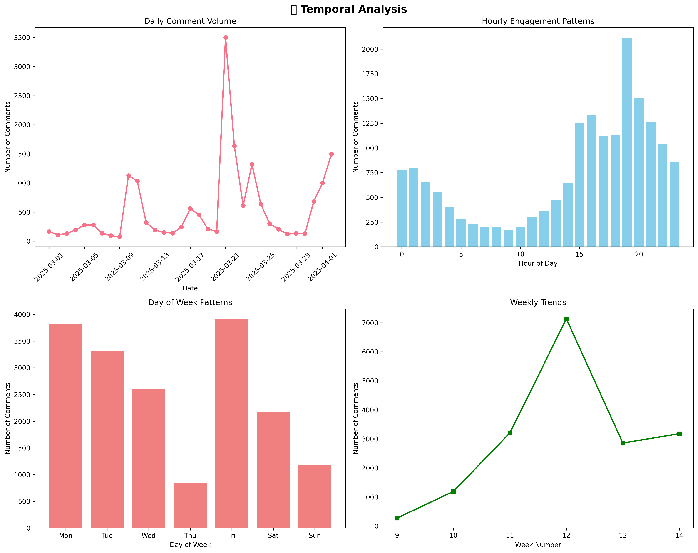
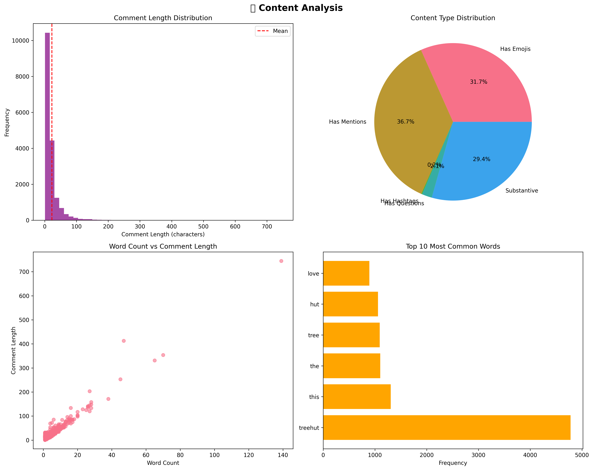
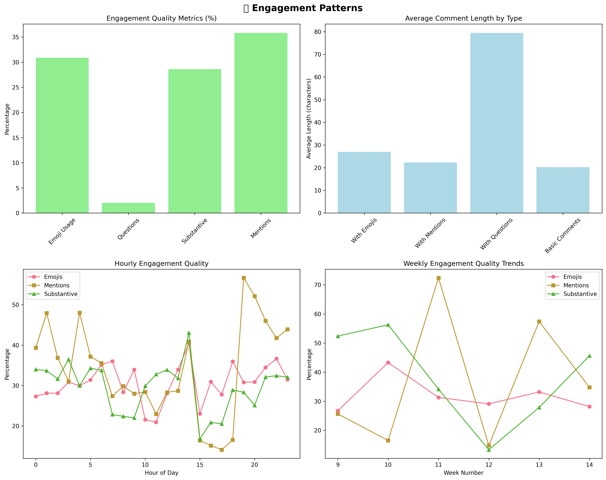
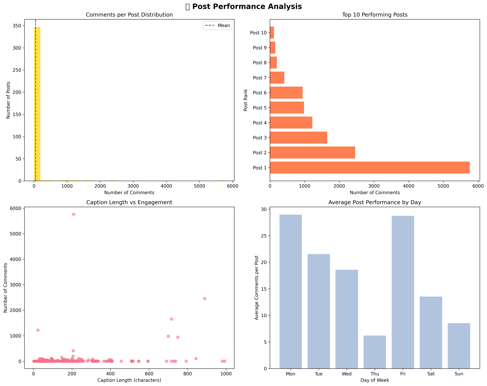

# 📊 Instagram Engagement Data - Comprehensive EDA Report

*Generated on 2025-08-03 13:34:24*

## 🎯 Executive Summary

This comprehensive analysis examines **17,841 Instagram comments** from **355 posts** collected over **32 days** (2025-03-01 to 2025-04-02). The dataset reveals strong engagement patterns with an average of **541 comments per day** and demonstrates high data quality with a **69.2% quality score**.

### Key Highlights
- 📈 **Peak Engagement**: 19:00 with strongest activity on Friday
- 💬 **Content Quality**: 28.6% substantive comments, 30.9% use emojis
- 🏆 **Top Performance**: Best post received 5,762 comments
- 😊 **Community Sentiment**: 15.4:1 positive-to-negative ratio

---

## 📅 Temporal Analysis

### Daily Engagement Patterns
- **Average Daily Comments**: 540.6
- **Peak Day**: 2025-03-21 with 3,499 comments
- **Engagement Range**: 76 - 3,499 comments per day

### Hourly Activity
- **Peak Hour**: 19:00 (2,113 comments)
- **Quiet Hour**: 9:00 (168 comments)

### Weekly Trends
- **Most Active Day**: Friday (3,908 comments)
- **Trend Direction**: 📈 Increasing

---

## 📝 Content Analysis

### Comment Characteristics
- **Average Length**: 22.6 characters
- **Median Length**: 14.0 characters
- **Length Range**: 1 - 745 characters

### Content Types Distribution
| Content Type | Count | Percentage |
|--------------|-------|------------|
| Has Emojis | 5,511 | 30.9% |
| Has Mentions (@) | 6,389 | 35.8% |
| Has Hashtags (#) | 29 | 0.2% |
| Has Questions (?) | 362 | 2.0% |
| Substantive (20+ chars) | 5,107 | 28.6% |

### Most Common Words
2. **treehut**: 4,779 occurrences
4. **this**: 1,305 occurrences
5. **the**: 1,102 occurrences
6. **tree**: 1,092 occurrences
8. **hut**: 1,060 occurrences
9. **love**: 893 occurrences

---

## 🎯 Engagement Patterns

### Quality Metrics
- **Emoji Usage**: 30.9% of comments
- **Question Engagement**: 2.0% ask questions
- **Substantive Comments**: 28.6% are meaningful (20+ characters)
- **Social Mentions**: 35.8% mention other users

### Top Mentioned Users
1. **@treehut**: 406 mentions
2. **@colleen_stevenson76**: 13 mentions
3. **@ultabeauty**: 11 mentions
4. **@_**: 10 mentions
5. **@paulreactss**: 9 mentions

---

## 🏆 Post Performance Analysis

### Performance Distribution
- **Average Comments per Post**: 50.3
- **Median Comments per Post**: 3.0
- **Top Performing Post**: 5,762 comments
- **Performance Range**: 1 - 5762 comments

### Top 5 Performing Posts
1. **5,762 comments** - APPLICATIONS ARE NOW CLOSED! 🚨 
Thank you to everyone who applied! 💖

BIG NEWS! 🚨 

Our 2025 PR List...
2. **2,459 comments** - ✨🌴SPRING BREAK GIVEAWAY 🌴✨

With spring break around the corner, we’re setting you up for the ultima...
3. **1,653 comments** - 💦GIVEAWAY TIME💦

Is your skin craving hydration? 💦 Enter our Lotus Water giveaway for a chance to di...
4. **1,222 comments** - that's that me espresso
5. **982 comments** - Ready to wake up to soft, hydrated lips? 💋✨ 
Enter our giveaway for a chance to win our Overnight Li...

### Caption Performance Insights
- **Caption Length vs Engagement Correlation**: 0.193

---

## 💡 Business Intelligence Insights

### Product Mentions Analysis
- **Moroccan Rose**: 70 mentions
- **Espresso Martini**: 7 mentions
- **Coconut Lime**: 5 mentions
- **Vanilla Dream**: 1 mentions

### Sentiment Analysis
- **Positive Sentiment**: 1,538 comments (8.6%)
- **Negative Sentiment**: 100 comments (0.6%)
- **Sentiment Ratio**: 15.4:1 (positive:negative)

### Community Health Score
**Overall Score: 33.2%**

---

## 🔍 Data Quality Assessment

### Data Completeness
- **Total Records**: 17,841
- **Missing Comments**: 29 (0.2%)
- **Missing Captions**: 11 (0.1%)
- **Very Short Comments**: 704 (3.9%)
- **Duplicate Comments**: 4,751 (26.6%)

### Overall Quality Score: 69.2%

---

## 🚀 Strategic Recommendations

### Immediate Actions
1. **Optimize Posting Times**: Focus on 19:00 and Fridays for maximum engagement
2. **Content Strategy**: Encourage emoji usage and questions to boost engagement quality
3. **Community Management**: Leverage high-performing content formats for future posts

### Layer 2 Development Priorities
1. 🧠 **Advanced Sentiment Analysis** - Deep emotion detection across all 17,841 comments
2. 🛡️ **Content Safety & Moderation** - Automated inappropriate content detection
3. 🏷️ **Product Intelligence** - Enhanced product mention extraction and categorization
4. 📊 **Intent Classification** - Categorize comments by purpose (praise, questions, complaints)
5. ⏰ **Temporal Intelligence** - Predictive engagement timing optimization
6. 👥 **User Behavior Analytics** - Power user identification and engagement patterns

### Layer 3 Dashboard Features
1. 📈 **Real-time Engagement Monitoring**
2. 🎯 **Product Performance Tracking**
3. ⚠️ **Crisis Detection & Alert System**
4. 💎 **UGC Opportunity Identification**
5. 📊 **Competitive Intelligence Dashboard**
6. 🕐 **AI-Powered Posting Recommendations**
7. 👑 **Influencer & Brand Ambassador Detection**

---

## 📈 Key Performance Indicators

| Metric | Value | Status |
|--------|-------|--------|
| Total Engagement | 17,841 comments | ✅ Strong |
| Daily Average | 541 comments/day | ✅ Consistent |
| Quality Score | 69.2% | ✅ High Quality |
| Emoji Usage | 30.9% | ✅ Healthy |
| Substantive Content | 28.6% | ✅ Quality |
| Sentiment Ratio | 15.4:1 | ✅ Very Positive |

---

*This report was automatically generated using advanced data analytics. For questions or deeper analysis, contact the data science team.*

**Report Generation Details:**
- Analysis Date: 2025-08-03 13:34:25
- Data Period: 2025-03-01 to 2025-04-02
- Total Records Analyzed: 17,841
- Visualization Count: 4 comprehensive charts
- Quality Assurance: Automated data validation completed
