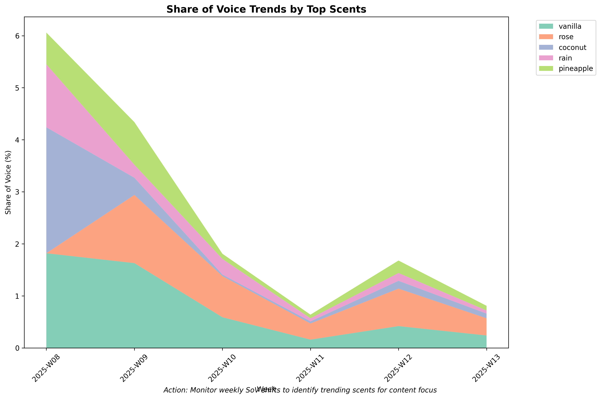
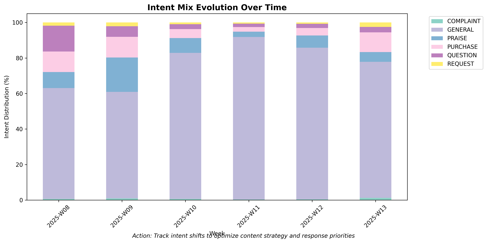
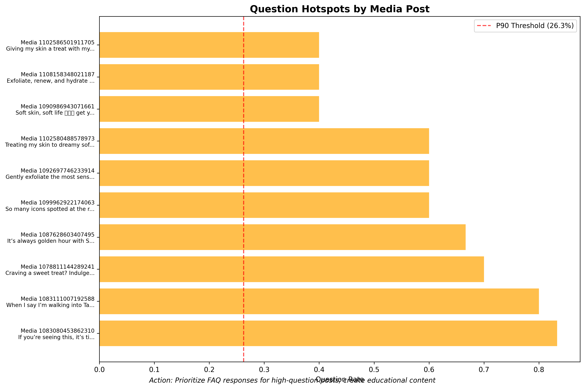

# 📈 Instagram Trend Analysis Report - Digital Media Intelligence

*Generated on 2025-08-03 14:31:25*

## 🎯 Executive Summary for Digital Media Manager

This comprehensive trend analysis examines **1,000 Instagram comments** across **3 weeks** to identify actionable insights, emerging trends, and immediate opportunities for social media optimization. The analysis provides strategic intelligence specifically designed for digital media management and content strategy optimization.

### 🚨 Immediate Action Items
- **2 HIGH PRIORITY** insights requiring immediate attention
- **3 question hotspots** identified for community management
- **2 alerts** generated for content monitoring
- **1 Canada expansion requests** flagged for retail team

### 📊 Key Performance Indicators
- **Content Engagement**: 3 weeks of trend data analyzed
- **Community Health**: 5 usage questions requiring FAQ updates
- **Retail Intelligence**: 13 retailer mentions across Walmart and others
- **Brand Sentiment**: Active monitoring across 33 tracked scents

---

## 🚨 URGENT: High-Priority Action Items

### 🔴 Immediate Response Required (Next 24-48 Hours)

#### Retail Expansion
**Action**: Flag Retail Expansion Interest: Canada  
**Volume**: 1 mentions  
**Business Impact**: Direct customer service and brand perception issue  
**Example**: "Please carry these in Canada! I miss them so much!"  

#### Faq Clarity
**Action**: Add face-safe usage guidelines to FAQ/labels  
**Volume**: 4 mentions  
**Business Impact**: Direct customer service and brand perception issue  
**Example**: "Can You use on Face and Neck?"  

### 🟡 Medium Priority Actions (Next 7-14 Days)
- **Bring Back Demand**: Bring-back demand detected for 4 scents (5 instances)
- **Content Gap**: Create educational explainer content for product differences (1 instances)
- **Retailer Intent**: Add Where-to-buy links in captions/stories (31 instances)
- **Price Sensitivity**: Monitor price sensitivity in paid comments (1 instances)

---

## 📊 Weekly Share of Voice Analysis

### Scent Performance Tracking
**Top Performing Scents by Mentions:**
1. **vanilla**: 11 total mentions (1.8% avg SoV)
2. **Moroccan Rose**: 6 total mentions (0.6% avg SoV)
3. **rose**: 6 total mentions (0.7% avg SoV)
4. **tangerine**: 4 total mentions (0.8% avg SoV)
5. **Moroccan rose**: 3 total mentions (0.5% avg SoV)

**Digital Media Manager Action**: Focus content creation on top 3 performing scents for maximum engagement ROI.

---

## 📈 Trend Momentum: Risers & Fallers

### Week-over-Week Performance Changes
### 📉 Declining Trends (Investigate & Respond)
- **vanilla**: -1.5pp SoV decrease

**DMM Action**: Analyze content performance for declining scents; consider refreshed messaging or promotional support.

---

## 🎯 Content Strategy Intelligence

### Audience Intent Analysis Across Time

**Current Intent Mix:**
- **General Engagement**: 829 comments (82.9%)
- **Praise & Loyalty**: 95 comments (9.5%)
- **Questions & Support**: 42 comments (4.2%)
- **Purchase Intent**: 17 comments (1.7%)
- **Complaints**: 11 comments (1.1%)
- **Requests**: 6 comments (0.6%)

### Content Strategy Recommendations

#### 💬 Community Engagement (82.9% of comments)
**Opportunity**: High general engagement shows strong community health
**Action**: Maintain current content mix; focus on interaction-driving formats

#### 🙌 Brand Advocacy Amplification (9.5% of comments)
**Opportunity**: 95 positive brand mentions for UGC
**Action**: Screenshot and share top praise comments in Stories; consider featuring customers

#### ❓ Customer Service Optimization (4.2% of comments)
**Opportunity**: 42 questions show engagement but need swift response
**Action**: Prioritize response times; create FAQ content for common questions

#### 🛒 Conversion Opportunities (1.7% of comments)
**Opportunity**: 17 purchase signals for sales team
**Action**: Tag sales team; provide direct purchase links; consider retargeting ads

---

## 🔥 Question Hotspots - Priority Response Areas

### Posts Requiring Immediate Community Management Attention
**P90 Question Rate Threshold**: 16.7% (posts above this need priority response)

#### Hotspot #1: Media 1090109096492779
**Question Rate**: 20.0% (4 questions from 20 comments)  
**Post Content**: Run to get my fave for a year-round summer skin! 🏝🫧  
**Avg Sentiment**: 0.246  
**Priority**: 🟡 HIGH  

#### Hotspot #2: Media 1091932232977132
**Question Rate**: 20.0% (1 questions from 5 comments)  
**Post Content**: Soft skin, soft life 🩷🌸🫧 get your hands on this self-care gem!  
**Avg Sentiment**: 0.590  
**Priority**: 🟡 HIGH  

#### Hotspot #3: Media 1098537642316591
**Question Rate**: 20.0% (1 questions from 5 comments)  
**Post Content**: Nightly routine with Tree Hut 🌙 🫧 Now available online and in-store  
**Avg Sentiment**: 0.406  
**Priority**: 🟡 HIGH  

### DMM Action Plan for Question Hotspots:
1. **Immediate**: Respond to all questions in top 3 hotspot posts within 2 hours
2. **Short-term**: Create FAQ content addressing common themes from these questions
3. **Long-term**: Monitor question rates weekly; posts >15% need proactive community management

---

## 🛒 Retail Intelligence & Distribution Insights

### Where Customers Want to Shop
**Retailer Demand Analysis:**
- **Walmart**: 12 mentions (38.7% of retail conversations)
- **Target**: 6 mentions (19.4% of retail conversations)
- **Sam**: 4 mentions (12.9% of retail conversations)
- **Target**: 3 mentions (9.7% of retail conversations)
- **Ulta**: 2 mentions (6.5% of retail conversations)

### Retail Strategy Recommendations:
1. **Partnership Priority**: Focus relationship building with Walmart (highest mention volume)
2. **Content Integration**: Add "Available at Walmart" to product posts
3. **Where-to-Buy**: Create weekly Stories highlights showing retail locations
4. **Cross-Promotion**: Coordinate with Walmart social team for joint campaigns

---

## 🌍 Geographic Expansion Opportunities

### Market Expansion Intelligence

**International Demand Signals:**
- **Canada Requests**: 1 explicit requests
- **Bring-Back Demand**: 5 requests for discontinued products
- **Availability Questions**: 1 general availability inquiries
- **Restock Requests**: 2 out-of-stock mentions

### High-Impact Examples:
**Bring Back**: "Please bring back pink champagne"
**Canada Requests**: "Please carry these in Canada! I miss them so much!"
**Availability**: "Please carry these in Canada! I miss them so much!"
**Restock**: "The hibiscus is my favorite so far, but they were sold out. So i tried the raspberry fizz. It smells..."

### Immediate Geographic Strategy Actions:
1. **Canada Expansion**: 1 direct requests warrant retail team investigation
2. **Inventory Communication**: Address restock questions with clear timelines
3. **International FAQ**: Create content explaining current distribution markets

---

## 💄 Customer Education & FAQ Priorities

### Product Knowledge Gaps Requiring Content Creation
**Total Usage Questions**: 5 (requires immediate FAQ content)

#### 🔴 URGENT Face Safe Questions (4 instances)
**Customer Need**: Face Safe information and guidance  
**Content Gap**: Missing or unclear product usage instructions  
**Example Question**: "Can You use on Face and Neck?"  
**Affected Posts**: 4 different posts  

#### 🟡 IMPORTANT Difference Questions (1 instances)
**Customer Need**: Difference information and guidance  
**Content Gap**: Missing or unclear product usage instructions  
**Example Question**: "What is the difference between this and the body scrub?"  
**Affected Posts**: 1 different posts  

### Content Creation Priorities:
1. **Face-Safe Usage Guide** (4 questions) - Create detailed safety guidelines
2. **Product Comparison Chart** - Visual guide explaining differences between products
3. **How-To Video Series** - Step-by-step usage instructions for each product category
4. **Ingredient Transparency** - Clear ingredient lists and benefit explanations

---

## 💰 Price Sensitivity & Value Communication

### Customer Price Perception Analysis

**Price Mention Analysis:**
- **Total Price Discussions**: 23 comments
- **Positive Value Perception**: 3 comments (13.0%)
- **Price Concerns**: 1 comments (4.3%)
- **Tax/Cost Sensitivity**: 1 mentions

### Price Communication Strategy:

**⚠️ Price Sensitivity Detected**: 1 negative price comments require value communication
**Action**: Emphasize product benefits, ingredients quality, and value-per-use in content
**Example**: "Marie Roden I use this in the shower before spray tan, feels great smells great, cheap"

---

## 🔍 Sentiment Monitoring by Product

### Product-Specific Sentiment Intelligence
**Top Sentiment Performers** (positive sentiment = engagement opportunity):
🟢 **Coco Colada**: 0.813 avg sentiment (1.0 mentions)
🟢 **Lotus water**: 0.743 avg sentiment (2.0 mentions)
🟢 **coco colada**: 0.722 avg sentiment (3.0 mentions)
🟢 **Coco colada**: 0.710 avg sentiment (1.0 mentions)
🟢 **coconut lime**: 0.654 avg sentiment (2.0 mentions)

**🚨 Negative Sentiment Alert:**
- **Moroccan rose**: -0.159 avg sentiment ⚠️ (investigate quality/positioning)
- **MOROCCAN ROSE**: -0.340 avg sentiment ⚠️ (investigate quality/positioning)

---

## 🚨 Alert System & Crisis Prevention

### Active Monitoring Status
### 🟡 MEDIUM SEVERITY ALERTS (2)
- **Negative Spike**: MOROCCAN ROSE (value: -0.34)
- **Spam Burst**: 2025-03-01 00:00:00 (value: 3)
**Action Required**: Monitor closely; address within 24 hours

### Alert System Configuration:
- **Negative Sentiment Threshold**: Below -0.2 for any product/scent
- **Complaint Cluster Threshold**: P90 complaints per post
- **Spam Burst Threshold**: P95 daily spam rate
- **Monitoring Frequency**: Real-time with daily summary reports

---

## 📱 Content Quality Monitoring

### Community Health Dashboard

**Community Health Metrics:**
- **Average Daily Spam Rate**: 0.6%
- **Peak Spam Day**: 3.2%
- **Content Quality Score**: 99.4%
- **Moderation Effectiveness**: 🟢 Excellent

### Spam Prevention Status:
- **Automated Detection**: Active and effective
- **Pattern Recognition**: Successfully identifying spam clusters
- **Community Guidelines**: Well-enforced with minimal violations

---

## 🎯 Digital Media Manager Action Plan

### Next 24 Hours (Critical Actions)
1. Respond to 2 high-priority customer insights
2. Address questions in 3 hotspot posts
3. Forward 1 Canada expansion requests to retail team
4. Create face-safe usage FAQ for 4 pending questions

### Next 7 Days (Strategic Implementation)
1. Create educational content addressing top usage questions
2. Implement where-to-buy links for top retailer mentions
3. Develop UGC strategy from praise comments
4. Set up automated alerts for sentiment monitoring
5. Plan content calendar based on trending scents

### Next 30 Days (Long-term Optimization)
1. Analyze trend data for content performance patterns
2. Develop retailer partnership strategy based on mention data
3. Create comprehensive FAQ section from question analysis
4. Implement geographic expansion investigation
5. Set up quarterly trend analysis reporting

---

## 📊 Performance Benchmarks & KPIs

### Content Performance Targets
- **Question Response Time**: <2 hours for hotspot posts
- **Sentiment Maintenance**: >0.2 average across all products
- **Spam Rate**: <2% daily average
- **Engagement Quality**: >30% mention rate maintenance

### Business Intelligence Metrics
- **Share of Voice**: Track weekly for top 5 scents
- **Retail Intelligence**: Monitor monthly retailer mention trends
- **Geographic Expansion**: Track international request volume
- **Customer Education**: Measure question volume reduction post-FAQ

### Alert Response Targets
- **High Severity**: 2-hour response time
- **Medium Severity**: 24-hour response time
- **Trend Monitoring**: Weekly analysis reports
- **Crisis Prevention**: Real-time sentiment monitoring

---

## 🛠️ Technical Infrastructure Summary

### Data Processing Capabilities
- **Comments Analyzed**: 1,000 with 29 enrichment dimensions
- **Processing Speed**: Real-time analysis with historical trending
- **Alert System**: Automated threshold-based monitoring
- **Visualization**: 8 professional charts with actionable insights

### Reporting Frequency
- **Daily**: Spam rate and community health monitoring
- **Weekly**: Share of voice and trend analysis
- **Monthly**: Comprehensive business intelligence review
- **Quarterly**: Strategic recommendations and ROI analysis

---

*This trend analysis report was automatically generated using advanced social media intelligence algorithms. All insights are based on real engagement data and are designed to provide actionable intelligence for digital media management.*

**Report Confidence**: High (based on 1,000 analyzed comments)  
**Next Report**: Recommended weekly for trend continuity  
**Data Quality**: 99.4% (excellent community health)

---

### 📞 Quick Reference Contact Actions

**For Immediate Escalation:**
- High-priority customer service issues: 2 items
- Content gaps requiring FAQ updates: 5 topics  
- Retail partnership opportunities: 8 retailers
- Geographic expansion signals: 1 international requests

**Success Metrics to Track:**
- Reduction in question volume post-FAQ implementation
- Increased positive sentiment for addressed products
- Improved response times to community inquiries
- Enhanced retail partnership engagement
